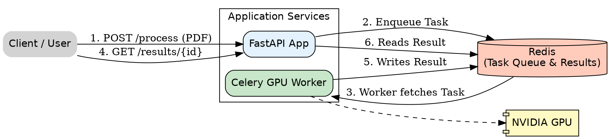

# Asynchronous Document OCR & Parsing Engine

This project provides a high-performance, asynchronous API for extracting structured text and layout information from PDF and image files. It is built with a robust architecture using FastAPI for the web layer, Celery for distributed task queuing, and Redis as a message broker.

The core OCR and document structure analysis is powered by Baidu's **PaddleOCR / PP-StructureV3** pipeline, optimized for accuracy and performance on a GPU.

This engine is designed to be the foundational "vision" component for higher-level AI workflows, such as invoice processing, contract analysis, and automated data entry.

## Table of Contents
- [Architecture Overview](#architecture-overview)
- [Prerequisites](#prerequisites)
- [Local Setup & Installation](#local-setup--installation)
- [Running the Service](#running-the-service)
- [API Contract & Usage](#api-contract--usage)
  - [1. Submit a Document for Processing](#1-submit-a-document-for-processing)
  - [2. Check Task Status and Retrieve Results](#2-check-task-status-and-retrieve-results)
- [Future Development](#future-development)

## Architecture Overview

The system is designed for scalability and responsiveness by decoupling the fast API from the slow, GPU-intensive OCR tasks.

- **FastAPI (The "Maître d'")**: A non-blocking web server that instantly accepts file uploads and queues them for processing. It provides endpoints to submit jobs and check their status.
- **Redis (The "Ticket Rail")**: A high-speed message broker that holds the queue of pending OCR tasks.
- **Celery Worker (The "Chef")**: A powerful background worker that consumes tasks from the Redis queue. It runs on a GPU-enabled machine and performs the actual document parsing using the PP-StructureV3 pipeline.



## Prerequisites

- **Docker & Docker Compose**: The entire application is containerized.
- **NVIDIA GPU & Drivers**: The Celery worker is configured to run on an NVIDIA GPU. You must have a compatible GPU and the [NVIDIA Container Toolkit](https://docs.nvidia.com/datacenter/cloud-native/container-toolkit/latest/install-guide.html) installed.

## Local Setup & Installation

1.  **Clone the repository:**
    ```bash
    git clone [your-repo-url]
    cd [your-repo-name]
    ```

2.  **Create an environment file:**
    Create a `.env` file in the root directory. This is used to configure the Redis connection.
    ```env
    # .env
    REDIS_URL=redis://redis:6379/0
    ```

3.  **Build the Docker containers:**
    This command will build the Docker images for both the `api` and `worker` services based on the `Dockerfile`.
    ```bash
    docker-compose build
    ```

## Running the Service

To start all services (FastAPI, Redis, Celery Worker), run:

```bash
docker-compose up
```

You should see logs from all three containers, indicating that the API is running on `http://localhost:8000` and the worker is connected to Redis, waiting for tasks.

To run in detached mode:
```bash
docker-compose up -d
```

## API Contract & Usage

The API provides two main endpoints for an asynchronous workflow.

### 1. Submit a Document for Processing

This endpoint accepts a file (PDF or image), queues it for processing, and immediately returns a `task_id`.

- **Endpoint:** `POST /api/v1/ocr/process`
- **Method:** `POST`
- **Body:** `multipart/form-data` with a single `file` field.

**Example cURL Request:**

```bash
curl -X POST -F "file=@/path/to/your/document.pdf" http://localhost:8000/api/v1/ocr/process
```

**Successful Response (Status 202 Accepted):**

The API immediately responds with a task ID, confirming the job has been queued.

```json
{
  "task_id": "e619b874-dc3d-4b49-bb22-07307e852987",
  "message": "OCR task queued successfully."
}
```

### 2. Check Task Status and Retrieve Results

Use the `task_id` from the previous step to poll this endpoint for the status and final result.

- **Endpoint:** `GET /api/v1/ocr/results/{task_id}`
- **Method:** `GET`

**Example cURL Request:**

```bash
curl http://localhost:8000/api/v1/ocr/results/e619b874-dc3d-4b49-bb22-07307e852987
```

**Response While Pending/Running:**

The `status` will be `PENDING` or `STARTED`. The `result` field will be `null`.

```json
{
  "task_id": "e619b874-dc3d-4b49-bb22-07307e852987",
  "status": "STARTED",
  "result": null,
  "pending_tasks": 0 
}
```

**Response on Success:**

The `status` will be `SUCCESS` and the `result` field will contain the structured OCR data.

```json
{
  "task_id": "e619b874-dc3d-4b49-bb22-07307e852987",
  "status": "SUCCESS",
  "result": {
    "detections": [
      {
        "text": "UNITED STATES",
        "box": [
          [466.0, 117.0],
          [757.0, 117.0],
          [757.0, 157.0],
          [466.0, 157.0]
        ],
        "confidence": 0.9991229772567749,
        "page_number": 1
      },
      // ... more detections
    ]
  },
  "pending_tasks": 0
}
```

**Response on Failure:**

The `status` will be `FAILURE` and the `result` will contain error information.

```json
{
  "task_id": "some-failed-task-id",
  "status": "FAILURE",
  "result": {
    "error": "Details about the exception that occurred."
  },
  "pending_tasks": 0
}
```

## Future Development

- **Implement LLM Layer:** Add a new Celery task that takes the structured JSON from the OCR task and uses a Large Language Model (e.g., via `LiteLLM`) to extract specific business entities (e.g., invoice total, vendor name).
- **Add Database Persistence:** Store the results in a database (e.g., PostgreSQL) instead of just in the Redis backend for long-term storage and querying.
- **Webhook Callbacks:** Instead of polling, implement a webhook system to notify a client application once a task is complete.

# logging
Always log to stdout in JSON format (never to files in containers).
Use a custom JSON formatter for all logs.
Add request/correlation IDs to every log (middleware for web apps).
Never use reserved LogRecord attribute names (like filename, levelname, etc.) in extra.
Use a single, centralized logging config loaded at startup.
Never use print for logging.
Let your platform (Kubernetes, Docker, cloud) aggregate logs.
Use log levels appropriately (DEBUG, INFO, WARNING, ERROR, CRITICAL).
Log exceptions with exc_info=True.
Add context to logs, but use safe field names