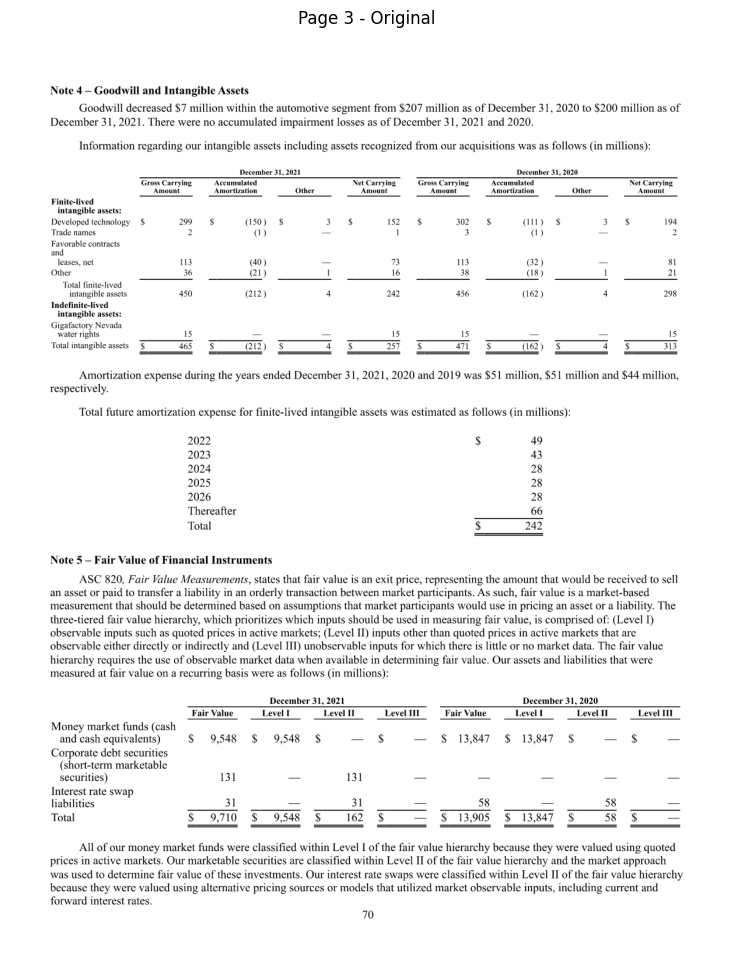
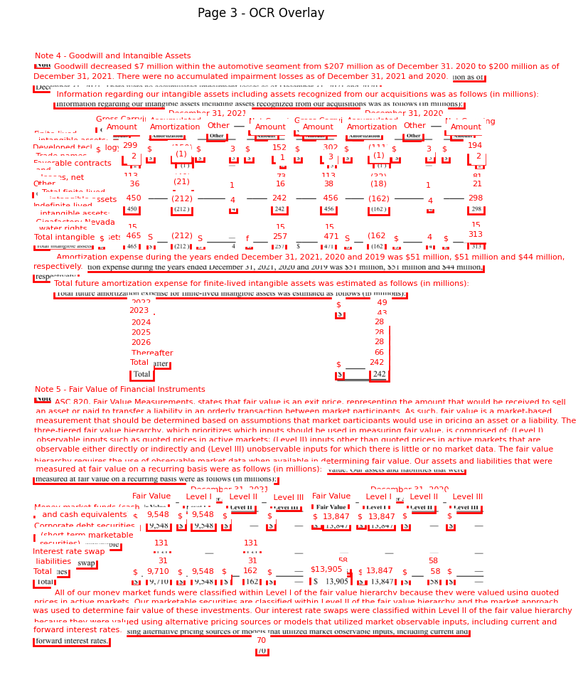
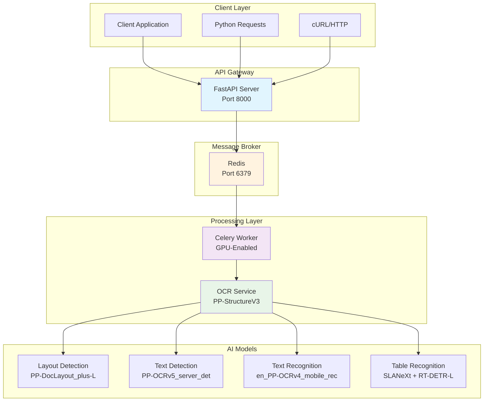
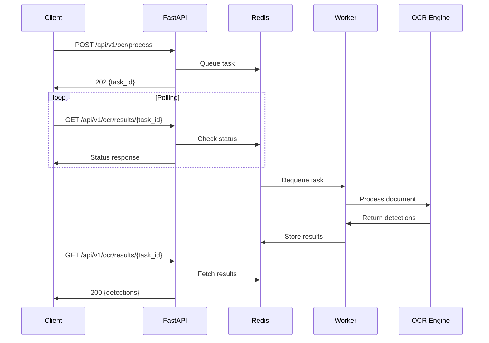

<div align="center">

# OCR Inference GPU

**High-Performance Asynchronous Document Processing Engine**

  

*Transform unstructured PDFs and images into structured, queryable data with GPU-accelerated OCR*


**Quick Start** • **Documentation** • **Architecture** • **API Reference** • **Contributing**

# </div>
---

## 🚀 Overview

A production-grade asynchronous OCR processing engine built for enterprise-scale document intelligence. The system combines FastAPI's high-performance web framework with Celery's distributed task processing, powered by PaddleOCR's PP-StructureV3 pipeline for state-of-the-art accuracy.

<!-- Hero Image showcasing OCR results -->
<p align="center">
    
    
</p>
<p align="center">Figure 1: Example comparison of an unprocessed document (left) and OCR overlay results (right).</p>


**Core Capabilities:**
- **Asynchronous Processing**: Non-blocking API with real-time status tracking
- **GPU Acceleration**: Optimized for NVIDIA CUDA environments
- **Multi-format Support**: PDFs and image formats (PNG, JPG, TIFF)
- **Enterprise Architecture**: Scalable microservices with Redis message brokering
- **Production Ready**: Containerized deployment with comprehensive error handling

**Technical Stack:**
- **Backend**: FastAPI with Pydantic validation
- **Task Queue**: Celery with Redis broker
- **OCR Engine**: PaddleOCR PP-StructureV3 pipeline
- **Containerization**: Docker Compose with GPU support
- **AI Models**: 13 specialized models for layout detection, text recognition, and table extraction

## 🏗️ Architecture

The system implements a microservices architecture optimized for high-throughput document processing:



**Component Responsibilities:**

| Component | Role | Technology | Scaling |
|-----------|------|------------|---------|
| **FastAPI Server** | Request handling, task orchestration | FastAPI + Uvicorn | Horizontal |
| **Redis Broker** | Message queuing, result storage | Redis 7 | Cluster-ready |
| **Celery Worker** | GPU-intensive OCR processing | Celery + PaddleOCR | Vertical (GPU) |
| **OCR Pipeline** | Document analysis and text extraction | PP-StructureV3 | Model-parallel |

## ⚡ Quick Start

### Prerequisites

- **Docker & Docker Compose**: Container orchestration platform
- **NVIDIA GPU & Drivers**: Compatible GPU with [NVIDIA Container Toolkit](https://docs.nvidia.com/datacenter/cloud-native/container-toolkit/latest/install-guide.html)
- **4GB+ GPU Memory**: Required for model inference
- **16GB+ System RAM**: Recommended

### Installation

1. **Clone and Setup**
   ```bash
   git clone https://github.com/your-username/ocr-inference-gpu.git
   cd ocr-inference-gpu
   ```

2. **Environment Configuration**
   ```bash
   # Create environment file
   echo "REDIS_URL=redis://redis:6379/0" > .env
   ```

3. **Build and Deploy**
   ```bash
   # Build containers
   docker-compose build
   
   # Start services
   docker-compose up
   ```

4. **Initial Model Download** ⚠️
   
   **IMPORTANT**: On first startup, the system downloads 13 AI models (~2-3GB total). This process takes around 30 seconds and must complete before the API becomes fully functional. Monitor the worker logs:
   
   ```bash
   docker-compose logs -f worker
   ```
   
   Look for: `✅ Celery: OCRService loaded.`

### Verification

```bash
# Health check
curl http://localhost:8000/docs

# Test with sample document
curl -X POST -F "file=@dataset/1page.pdf" \
     http://localhost:8000/api/v1/ocr/process
```

## 📡 API Reference

### Document Processing Workflow



### Endpoints

#### Submit Document Processing

```http
POST /api/v1/ocr/process
Content-Type: multipart/form-data

file: <PDF or image file>
```

**Response (202 Accepted)**
```json
{
  "task_id": "a0cbcc44-7857-45a9-b6d2-f0cf91b81cce",
  "status": "pending",
  "message": "OCR task queued successfully."
}
```

#### Retrieve Processing Results

```http
GET /api/v1/ocr/results/{task_id}
```

**Response Schema**
```json
{
  "task_id": "string",
  "status": "SUCCESS" | "PENDING" | "STARTED" | "FAILURE",
  "result": {
    "detections": [
      {
        "text": "string",
        "box": [[x1, y1], [x2, y2], [x3, y3], [x4, y4]],
        "confidence": 0.0-1.0,
        "page_number": 1
      }
    ]
  },
  "pending_tasks": 0
}
```

### Client Implementation

**Python Example**
```python
import requests
import time

BASE_URL = "http://localhost:8000"

# Submit document
with open("document.pdf", "rb") as f:
    response = requests.post(
        f"{BASE_URL}/api/v1/ocr/process",
        files={"file": ("document.pdf", f, "application/pdf")}
    )
    task_id = response.json()["task_id"]

# Poll for results
while True:
    result = requests.get(f"{BASE_URL}/api/v1/ocr/results/{task_id}")
    data = result.json()
    
    if data["status"] == "SUCCESS":
        detections = data["result"]["detections"]
        print(f"Extracted {len(detections)} text elements")
        break
    elif data["status"] == "FAILURE":
        print(f"Processing failed: {data['result']['error']}")
        break
    
    time.sleep(2)
```

**Visualization Example**
```python
import matplotlib.pyplot as plt
import matplotlib.patches as patches
from PIL import Image

def visualize_detections(image_path, detections, page_number=1):
    """Overlay bounding boxes on document image"""
    img = Image.open(image_path)
    fig, ax = plt.subplots(figsize=(12, 16))
    ax.imshow(img)
    
    page_detections = [d for d in detections if d["page_number"] == page_number]
    
    for detection in page_detections:
        box = detection["box"]
        xs, ys = zip(*box)
        
        rect = patches.Rectangle(
            (min(xs), min(ys)), 
            max(xs) - min(xs), 
            max(ys) - min(ys),
            linewidth=2, 
            edgecolor='red', 
            facecolor='none'
        )
        ax.add_patch(rect)
        
        ax.text(
            min(xs), min(ys) - 5, 
            detection["text"][:50], 
            color='red', 
            fontsize=8, 
            backgroundcolor='white'
        )
    
    ax.set_title(f"Page {page_number} - {len(page_detections)} detections")
    plt.axis('off')
    plt.show()
```

## 🔧 Configuration

### Pipeline Configuration

The OCR pipeline is configured via `src/configs/pipelines/PP-StructureV3.yaml`:

```yaml
pipeline_name: PP-StructureV3
batch_size: 4
use_doc_preprocessor: True
use_table_recognition: True

SubModules:
  LayoutDetection:
    model_name: PP-DocLayout_plus-L
    threshold:
      0: 0.3  # Text regions
      1: 0.5  # Titles
      2: 0.4  # Lists
      # ... additional classes
```

### Model Architecture

| Model | Purpose | Size | Precision |
|-------|---------|------|-----------|
| `PP-DocLayout_plus-L` | Layout detection and segmentation | ~200MB | High |
| `PP-OCRv5_server_det` | Text line detection | ~180MB | High |
| `en_PP-OCRv4_mobile_rec` | English text recognition | ~25MB | Mobile-optimized |
| `SLANeXt_wired` | Table structure recognition | ~150MB | Enterprise |
| `RT-DETR-L_*_table_cell_det` | Table cell detection | ~300MB | High precision |

### Performance Tuning

**Memory Optimization**
```yaml
# Reduce batch size for lower memory usage
batch_size: 2

# Disable unused modules
use_seal_recognition: False
use_formula_recognition: False
use_chart_recognition: False
```

**Throughput Optimization**
```yaml
# Increase batch size for higher throughput
batch_size: 8

# Worker concurrency
command: celery -A src.tasks.celery_app worker --concurrency=4
```

## 🚀 Deployment

### Production Configuration

### Monitoring

**Health Checks**
```bash
# API health
curl http://localhost:8000/health

# Worker status
celery -A src.tasks.celery_app inspect active

# Redis metrics
redis-cli info memory
```

**Performance Metrics**
 **Performance Metrics (RTX 3050 4GB Laptop)**
 - **Throughput**: ~20 pages/minute (~3 seconds per page)
 - **Latency**: ~3 seconds per page for 300 DPI input
 - **Memory**: 4GB GPU, ~4-6GB system RAM


### Architecture Decisions

**Why FastAPI?** High-performance async framework with automatic OpenAPI documentation

**Why Celery?** Proven distributed task queue with robust error handling and retry mechanisms

**Why PaddleOCR?** State-of-the-art accuracy with production-ready performance and Chinese text support

**Why Redis?** In-memory performance for task queuing with persistence options