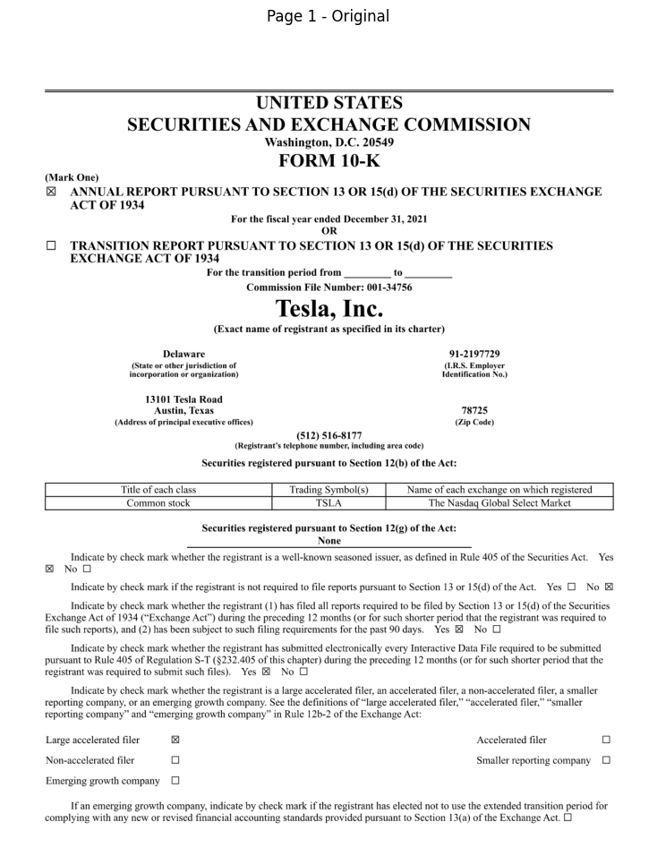
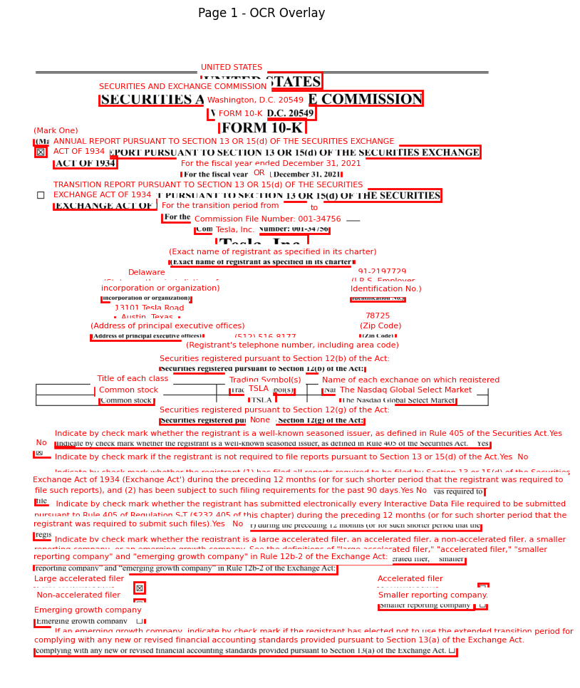
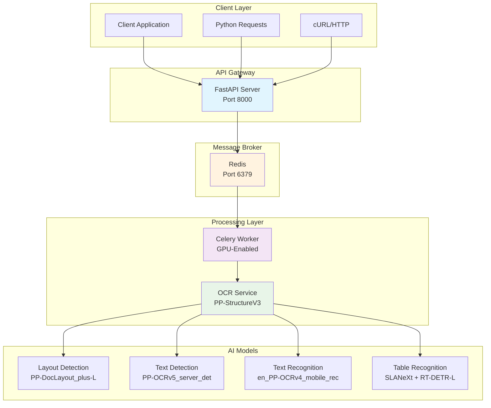
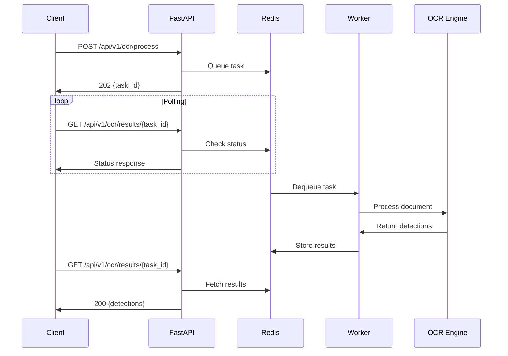

<div align="center">

# OCR Inference GPU

**High-Performance Asynchronous Document Processing Engine**

  

*Transform unstructured PDFs and images into structured, queryable data with GPU-accelerated OCR*


**Quick Start** • **Documentation** • **Architecture** • **API Reference** • **Contributing**

# </div>
---

## 🚀 Overview

A production-grade asynchronous OCR processing engine built for enterprise-scale document intelligence. The system combines FastAPI's high-performance web framework with Celery's distributed task processing, powered by PaddleOCR's PP-StructureV3 pipeline for state-of-the-art accuracy.

### Before vs After

This is exactly what the service does: takes a raw document page and returns OCR detections (text + bounding boxes + confidence), so you can visualize and extract structured information.

<p align="center">
    
    
</p>
<p align="center"><em>Left: original page. Right: OCR detections overlaid as text regions.</em></p>


**Core Capabilities:**
- **Asynchronous Processing**: Non-blocking API with real-time status tracking
- **GPU Acceleration**: Optimized for NVIDIA CUDA environments
- **Multi-format Support**: PDFs and image formats (PNG, JPG, TIFF)
- **Enterprise Architecture**: Scalable microservices with Redis message brokering
- **Production Ready**: Containerized deployment with comprehensive error handling

**Technical Stack:**
- **Backend**: FastAPI with Pydantic validation
- **Task Queue**: Celery with Redis broker
- **OCR Engine**: PaddleOCR PP-StructureV3 pipeline
- **Containerization**: Docker Compose with GPU support
- **AI Models**: 13 specialized models for layout detection, text recognition, and table extraction

## 🏗️ Architecture

The system implements a microservices architecture optimized for high-throughput document processing:


```mermaid
graph TB
    subgraph "Client Layer"
        A[Client Application]
        B[Python Requests]
        C[cURL/HTTP]
    end
    
    subgraph "API Gateway"
        D[FastAPI Server<br/>Port 8000]
    end
    
    subgraph "Message Broker"
        E[Redis<br/>Port 6379]
    end
    
    subgraph "Processing Layer"
        F[Celery Worker<br/>GPU-Enabled]
        G[OCR Service<br/>PP-StructureV3]
    end
    
    subgraph "AI Models"
        H[Layout Detection<br/>PP-DocLayout_plus-L]
        I[Text Detection<br/>PP-OCRv5_server_det]
        J[Text Recognition<br/>en_PP-OCRv4_mobile_rec]
        K[Table Recognition<br/>SLANeXt + RT-DETR-L]
    end
    
    A --> D
    B --> D
    C --> D
    D --> E
    E --> F
    F --> G
    G --> H
    G --> I
    G --> J
    G --> K
    
    style D fill:#e1f5fe
    style E fill:#fff3e0
    style F fill:#f3e5f5
    style G fill:#e8f5e8
```

**Component Responsibilities:**

| Component | Role | Technology | Scaling |
|-----------|------|------------|---------|
| **FastAPI Server** | Request handling, task orchestration | FastAPI + Uvicorn | Horizontal |
| **Redis Broker** | Message queuing, result storage | Redis 7 | Cluster-ready |
| **Celery Worker** | GPU-intensive OCR processing | Celery + PaddleOCR | Vertical (GPU) |
| **OCR Pipeline** | Document analysis and text extraction | PP-StructureV3 | Model-parallel |

## ⚡ Quick Start (2 minutes)

### Prerequisites

- Docker + Docker Compose
- NVIDIA GPU with CUDA drivers and [NVIDIA Container Toolkit](https://docs.nvidia.com/datacenter/cloud-native/container-toolkit/latest/install-guide.html)
- Recommended: 4GB+ GPU VRAM, 16GB+ system RAM

### 1) Clone and configure

```bash
git clone https://github.com/your-username/ocr-inference-gpu.git
cd ocr-inference-gpu
cp .env.example .env
```

`REDIS_URL` is already configured for Docker in `.env.example`:

```env
REDIS_URL="redis://redis:6379/0"
```

### 2) Start the stack

```bash
docker-compose up --build
```

Services:
- API: `http://localhost:8000`
- OpenAPI docs: `http://localhost:8000/docs`
- Redis broker: `localhost:6379`

### 3) Wait for first model warmup

On first run, Paddle models are downloaded. Watch worker logs until OCR service is loaded:

```bash
docker-compose logs -f worker
```

### 4) Run your first OCR call

```bash
curl -X POST "http://localhost:8000/api/v1/ocr/process" \
  -F "file=@dataset/1page.pdf"
```

Copy the returned `task_id`, then:

```bash
curl "http://localhost:8000/api/v1/ocr/results/<task_id>"
```

Repeat the `results` call until `status` becomes `SUCCESS`.

## 📡 Simple API Usage

### Document Processing Workflow


```mermaid
sequenceDiagram
    participant C as Client
    participant API as FastAPI
    participant R as Redis
    participant W as Worker
    participant OCR as OCR Engine
    
    C->>API: POST /api/v1/ocr/process
    API->>R: Queue task
    API->>C: 202 {task_id}
    
    loop Polling
        C->>API: GET /api/v1/ocr/results/{task_id}
        API->>R: Check status
        API->>C: Status response
    end
    
    R->>W: Dequeue task
    W->>OCR: Process document
    OCR->>W: Return detections
    W->>R: Store results
    
    C->>API: GET /api/v1/ocr/results/{task_id}
    API->>R: Fetch results
    API->>C: 200 {detections}
```

### Core endpoints

#### 1) Queue OCR job

```http
POST /api/v1/ocr/process
Content-Type: multipart/form-data
file=<PDF or image>
```

Returns `202 Accepted`:

```json
{
  "task_id": "a0cbcc44-7857-45a9-b6d2-f0cf91b81cce",
  "status": "pending",
  "message": "OCR task queued successfully."
}
```

#### 2) Fetch OCR job result

```http
GET /api/v1/ocr/results/{task_id}
```

Returns task state plus OCR output when done:

```json
{
  "task_id": "string",
  "status": "SUCCESS",
  "result": {
    "detections": [
      {
        "text": "Tesla, Inc.",
        "box": [[x1, y1], [x2, y2], [x3, y3], [x4, y4]],
        "confidence": 0.99,
        "page_number": 1
      }
    ]
  },
  "pending_tasks": 0
}
```

### Client Implementation

### Minimal Python client
```python
import requests
import time

BASE_URL = "http://localhost:8000"

# 1) Submit document
with open("dataset/1page.pdf", "rb") as f:
    response = requests.post(
        f"{BASE_URL}/api/v1/ocr/process",
        files={"file": ("1page.pdf", f, "application/pdf")}
    )
    task_id = response.json()["task_id"]

# 2) Poll until complete
while True:
    result = requests.get(f"{BASE_URL}/api/v1/ocr/results/{task_id}")
    data = result.json()
    
    if data["status"] == "SUCCESS":
        detections = data["result"]["detections"]
        print(f"Extracted {len(detections)} text detections")
        print(detections[:3])  # first few detections
        break
    elif data["status"] == "FAILURE":
        print(f"Processing failed: {data.get('result', {}).get('error', 'Unknown error')}")
        break
    
    time.sleep(2)
```

### Bounding box coordinates (important)

To render boxes in the **correct place**, use the same pixel space as OCR:

- `box` uses image pixel coordinates in `[x, y]` order
- Origin is top-left: `(0, 0)` is top-left of the OCR input image
- `page_number` is 1-based for PDFs
- For PDFs in this service, each page is rendered at `fitz.Matrix(2, 2)` before OCR, so boxes align to the rendered page image (2x scale of PDF points)

If your UI displays a resized image/canvas, scale bbox coordinates:

```text
scale_x = displayed_width  / original_image_width
scale_y = displayed_height / original_image_height
display_x = original_x * scale_x
display_y = original_y * scale_y
```

### Correct overlay example (polygon-safe)

Use polygons (not only axis-aligned rectangles) so rotated/skewed text still aligns:

```python
import matplotlib.pyplot as plt
from matplotlib.patches import Polygon
from PIL import Image

def visualize_detections(image_path, detections, page_number=1):
    img = Image.open(image_path).convert("RGB")
    fig, ax = plt.subplots(figsize=(12, 16))
    ax.imshow(img)

    page_detections = [d for d in detections if d["page_number"] == page_number]
    for detection in page_detections:
        points = detection["box"]  # [[x1,y1],[x2,y2],[x3,y3],[x4,y4]]

        # Draw exact OCR polygon
        poly = Polygon(points, closed=True, fill=False, edgecolor="red", linewidth=1.5)
        ax.add_patch(poly)

        # Label near first point
        x0, y0 = points[0]
        ax.text(
            x0,
            max(0, y0 - 3),
            detection["text"][:50],
            color="red",
            fontsize=7,
            backgroundcolor="white",
        )

    ax.set_title(f"Page {page_number} - {len(page_detections)} detections")
    ax.axis("off")
    plt.tight_layout()
    plt.show()
```

### Quick sanity check for alignment

1. Call OCR and get `detections`
2. Render overlay on the exact same source image used for OCR
3. Confirm words and polygons line up visually
4. If they drift, verify:
   - image was resized after OCR (apply `scale_x`, `scale_y`)
   - wrong PDF page image scale was used
   - coordinates were rounded/truncated too early

## 🔧 Configuration

### Pipeline Configuration

The OCR pipeline is configured via `src/configs/pipelines/PP-StructureV3.yaml`:

```yaml
pipeline_name: PP-StructureV3
batch_size: 4
use_doc_preprocessor: True
use_table_recognition: True

SubModules:
  LayoutDetection:
    model_name: PP-DocLayout_plus-L
    threshold:
      0: 0.3  # Text regions
      1: 0.5  # Titles
      2: 0.4  # Lists
      # ... additional classes
```

### Model Architecture

| Model | Purpose | Size | Precision |
|-------|---------|------|-----------|
| `PP-DocLayout_plus-L` | Layout detection and segmentation | ~200MB | High |
| `PP-OCRv5_server_det` | Text line detection | ~180MB | High |
| `en_PP-OCRv4_mobile_rec` | English text recognition | ~25MB | Mobile-optimized |
| `SLANeXt_wired` | Table structure recognition | ~150MB | Enterprise |
| `RT-DETR-L_*_table_cell_det` | Table cell detection | ~300MB | High precision |

### Performance Tuning

**Memory Optimization**
```yaml
# Reduce batch size for lower memory usage
batch_size: 2

# Disable unused modules
use_seal_recognition: False
use_formula_recognition: False
use_chart_recognition: False
```

**Throughput Optimization**
```yaml
# Increase batch size for higher throughput
batch_size: 8

# Worker concurrency
command: celery -A src.tasks.celery_app worker --concurrency=4
```

## 🚀 Deployment

### Production Configuration

### Monitoring

**Health Checks**
```bash
# API health
curl http://localhost:8000/health

# Worker status
celery -A src.tasks.celery_app inspect active

# Redis metrics
redis-cli info memory
```

**Performance Metrics**
 **Performance Metrics (RTX 3050 4GB Laptop)**
 - **Throughput**: ~20 pages/minute (~3 seconds per page)
 - **Latency**: ~3 seconds per page for 300 DPI input
 - **Memory**: 4GB GPU, ~4-6GB system RAM


### Architecture Decisions

**Why FastAPI?** High-performance async framework with automatic OpenAPI documentation

**Why Celery?** Proven distributed task queue with robust error handling and retry mechanisms

**Why PaddleOCR?** State-of-the-art accuracy with production-ready performance and Chinese text support

**Why Redis?** In-memory performance for task queuing with persistence options